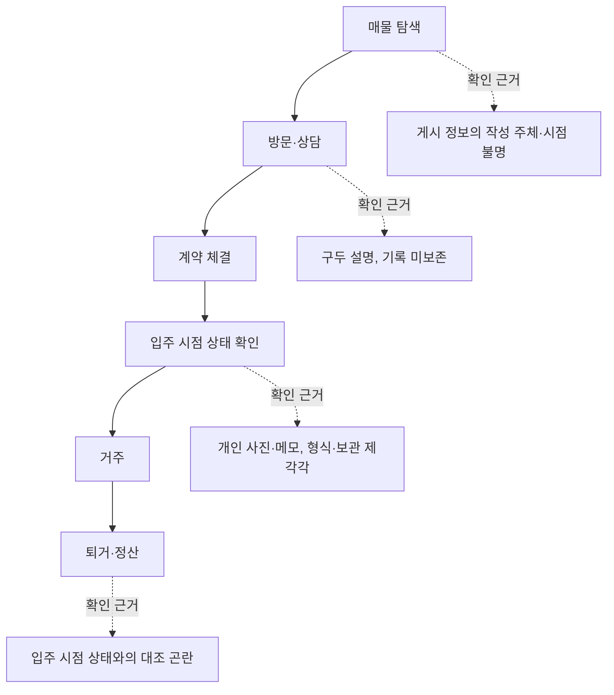
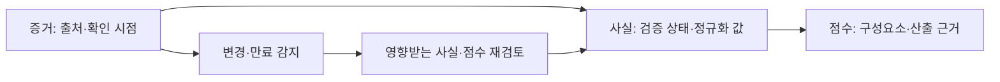
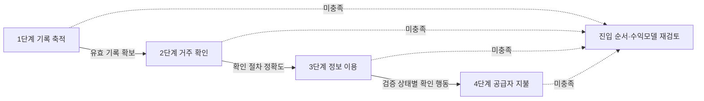

# G밸리 신청 패키지 — 통합 검토 원고 2026-09-26 (6판)

6판에서 [접수 요건 공고문 원문 확정본](/DOW/issues/DOW-1234#document-intake-requirements)을 반영해 정정 3건(병합 범위 확정·예비창업자 날인 조건·서식5 가점 2점과 두 경로 분리)과 추가 2건(템플릿 안내문 삭제 후 분량 측정, 접수 구글폼 사전 확인)을 적용했다. 분량 수치도 이식본 실측값으로 갱신했다.

CMO 보완본 3차와 시장 통계 출처 대장 3판을 반영하고, 후속 내용 검수의 수정 요청 3건을 반영했다. 이전 초안의 미검증 운영·특허·경쟁사 단정은 이 원고에서 제외했다. 이전 내용은 문서 개정 이력에 보존한다. **공식 편집본 또는 제출용 스캔 PDF가 아니며, 실제 페이지 수는 출력 후에만 확정된다.**

2026-09-26 5판에서 [증빙 판정](/DOW/issues/DOW-1235#document-evidence-verification)을 반영한 서식2 2.2 확정 원고와 증량 원고 4건(1.3 확장·도표 2·2.1 확장·3.2 게이트·4장 입력 틀)을 이식했다. 이식 전 추정 2.21~2.72쪽으로 **필수 최소 5쪽에 미달**했고, 이식본 실측은 **5.42~6.68쪽**이다(`scripts/stats/gvalley_page_budget.py` 실측값. 이전 판의 5.09~6.22쪽은 이식 전 추정치였다). 보수 가정에서도 최소 5쪽을 넘지만 여유가 0.42쪽뿐이므로 **4장 보드 입력이 도착하기 전에는 분량 요건 충족을 확정으로 판정하지 않는다.** 산정 근거는 [분량 예산 문서](/DOW/issues/DOW-1234#document-page-budget) 6절이다.

근거: [CMO 보완본](/DOW/issues/DOW-1234#document-supplement), [통계 출처 대장](/DOW/issues/DOW-1154#document-market-statistics). 이번 갱신은 검수된 내부 자료의 통합이며 외부 원문의 신규 재검증은 아니다.

## 1. 진행 조건과 담당

접수 마감은 기존 공고 확인 기록상 2026-10-08 17:00이다. 신청 준비를 조건부 진행하며 최종 적격·응모·제출은 확정하지 않았다. 보드의 응모 의사와 10월 21~30일 프로그램 및 11월 4일 행사 참여 가능 여부는 9월 30일 게이트에서 확인한다.

| 산출물 | 담당 | 기한·수용 기준 |
|---|---|---|
| 기술·운영·특허 증빙 | CTO / [DOW-1235](/DOW/issues/DOW-1235) | 9월 30일 첫 보고. 주장별 기준일·증빙·허용 문구, 구현/빌드/배포/실사용 구분 |
| 공식 HWP 반영·PDF 출력 | CMO / [DOW-1234](/DOW/issues/DOW-1234) | 원본 확보 및 편집 가능 여부 먼저 보고. 10월 3일 편집본, 10월 5일 출력 검토본. 사업개발이 통합 검수 |
| 통합 내용 검수 | 사업개발 | 10월 5일 검토본, 10월 7일 CEO 최종 검토 |
| 대표자·기업·경력·수상 이력 | 보드 / [공통 프로필](/DOW/issues/DOW-1090#document-profile) | 기업형태 10월 1일, 최종 입력 10월 5일. 개인정보는 최종 서식에 직접 입력 |
| 동의 선택·날인 | 보드 | 내용을 직접 확인하고 10월 6일까지 처리 |

운영사 문의는 [기존 발송 승인](/DOW/approvals/ee65ea69-3c50-4218-914d-eee31003a46a) 경로를 유지한다. 문의 승인과 접수 승인은 별개다. 경진대회를 위한 신규 개발은 추가하지 않는다.

## 2. 제출서류와 서식1

기업형태 미확인 상태이므로 면제는 조건부다. CMO 원문 대조 기록상 서식1~4는 필수, 서식5는 입주 사실이 있을 때 추가한다. 예비창업자는 붙임1·3 제외, 붙임2·4는 법인에 해당하며 붙임5 IR은 선택이다. 입주 여부는 미확인이며 가점을 미리 포기하거나 해당 없음으로 단정하지 않는다.

서식2는 최소 5페이지, 10페이지 내외 권장, 최대 15페이지다.

**제출물은 HWP 파일이 아니라 스캔 PDF다.** 신청서 원문 58행(`docs/business-development/gvalley-2026/official-application-extracted.txt`)을 사업개발이 직접 열어 대조했다: "지원신청서를 포함한 위 제출서류를 순서대로 하나의 파일로 스캔하여 PDF 파일로 제출". 바로 다음 행에 "제출서식 미준수 시 서류심사 대상에서 제외될 수 있음"이 붙는다. HWP 재저장은 제출 요건이 아니며, 편집 환경은 인쇄 가능한 서식을 만들기 위한 수단이다.

**병합 범위는 확정됐다.** 신청서 58행의 "위 제출서류"는 범위가 모호하지만, 공고문 원문 150~157행이 같은 요건을 두 갈래로 직접 분리한다: "**서식 1~5**에 해당하는 서류를 순서대로 **하나의 파일로 스캔**하여 pdf 파일로 제출하고, **붙임 1~5의 서류**는 신청 링크의 해당 항목에 **개별 pdf로 제출**". 모순이 아니라 구체적 기술이 모호한 기술을 확정해 주는 관계이므로 문의 항목에서 제외한다. 확정 규칙은 다음과 같다.

- **병합 스캔 PDF 1개**: 서식1 → 서식2 → 서식3 → 서식4 → (해당 시) 서식5 순서
- **붙임1~5**: 접수 구글폼의 해당 항목에 개별 PDF로 각각 업로드

전자날인 허용 여부는 두 원문 어디에도 없어 미확인으로 남으며 운영사 문의 대상이다. 근거는 [접수 요건 확정본](/DOW/issues/DOW-1234#document-intake-requirements)이다.

| 항목 | 기재값 | 상태 |
|---|---|---|
| 신청 기업명 | `(예비창업자 → 대표자 성함)` | 보드 입력. 서식 지시에 따라 성함 기재 |
| 사업 아이템 (한 줄 이내) | **거주 경험과 입주 상태 기록의 근거 확인을 돕는 임대차 서비스 「입주해」** | 제안 문안·CTO 판정 후 확정 |
| 구분 | ☐ 예비창업자 ☐ 개인사업자 ☐ 법인사업자 | 보드 확정 ([프로필](/DOW/issues/DOW-1090#document-profile) 값 1) |
| 기술분야 | ☑ **기타** | ✅ 확정. 제시 4개 분야(AI 제조자동화·로봇 자동화·친환경/탄소중립·스마트 물류) 중 해당 없음. 공고가 "全 분야"를 명시하므로 기타 선택이 맞다 |
| 대표자 성명 / 생년월일 | | 보드 직접 입력 (문서에 미기재) |
| 웹사이트 / SNS 주소 | 서비스 URL + 저장소 URL | 보드 확인 후 기재 |
| 사업자등록번호 | 예비창업자면 **미기재** | 서식이 "없을 시 미기재" 명시 |
| 설립일 | 예비창업자면 **미기재** | 동일 |
| 직원 수 | | 보드 ([프로필](/DOW/issues/DOW-1090#document-profile) 값 6) |
| 기업 본사 주소 | | 보드. **예비창업자 기재 기준 미확인 → 문의 2** |
| 대표자 연락처 / e-mail | | 보드 직접 입력 |
| 담당자 연락처 / e-mail | | 대표자와 동일 시 동일 기재 |
| 제1~9회차 수상 여부 | ☐ 미확인 | 보드가 수상 이력 확인 후 선택 |
| 작성일 / 기업명 / 대표자 (인) | 2026년 __월 __일 | **날인 — 보드 실행** |

**날인이 필요한 서식은 3개다.** 신청서 원문 직접 대조 결과 `(인)` 표기는 서식1(64행), 서식3(252행), 서식4(273행)에 있다. 서식2·5에는 없다. 세 서식 모두 인쇄 후 날인하고 다시 스캔해야 하므로 출력물 한 부에 세 번 날인하는 단일 작업으로 묶는다.

**기업형태가 예비창업자로 확정돼도 날인은 면제되지 않는다.** 공고문 122~123행은 서식1에 대해 "회사직인 필수 **(예비창업자는 본인날인 필수)**"로 적는다. 법인·개인사업자는 회사직인, 예비창업자는 대표자 본인날인으로 수단만 바뀌고 10-06 날인 작업 자체는 어느 경우에도 남는다.

## 3. 서식2 사업계획서 — 통합 본문

### 1. 문제인식 (20점)

#### 1.1 창업아이템 개요

입주해는 거주 경험과 입주 당시 상태 기록의 출처·확인 시점·검증 상태를 정리해 임대차 정보 확인을 돕는 서비스를 지향한다. 증거, 정규화된 사실, 설명 가능한 점수와 변경 관리가 설계의 중심이다. 아래 기술 설명은 설계 목표이며 실제 구현·배포 범위는 CTO 검증 후 확정한다.

#### 1.2 개발배경 및 필요성

임차인은 매물과 거주 경험에 관한 정보를 확인할 때 작성 주체, 확인 시점, 근거 자료를 함께 살펴볼 필요가 있다. 입주해는 이 정보를 정리해 이용자의 확인을 돕는 방식을 검토한다. 작성자의 거주 확인과 정보 출처 표시가 후기 판단에 도움이 되는지는 이용자 검증으로 확인할 예정이다.

임차인 무료 이용을 기본 사업 가설로 두고, 공급자에게 검증 정보의 가치를 제공하는 수익모델을 검토한다. 공급자의 지불 의사와 검증 비용을 확인하기 전에는 수익성을 확정하지 않는다. 사후 분쟁 접수 통계는 관측된 신청 규모를 설명하는 자료이며, 입주해의 사전 기록 기능이 분쟁을 줄인다는 인과 근거는 아니다.

#### 1.3 목표시장 분석

초기 고객군은 수도권에서 첫 독립 후 1~3년이 지난 원룸·오피스텔 임차인으로 가정한다. 연령별 피해 집중이나 앱 이용 우위는 확인된 근거가 없어 주장하지 않는다. 고객군 적합성은 인터뷰·참여·재방문 자료로 검증한다.

국토교통부 「2024년도 주거실태조사」에 따르면 2024년 전국 가구의 임차 비율은 38.0%, 수도권은 44.4%다. 이는 가구 기준 표본조사 결과다.

국토교통부 「'25년 12월 주택통계」의 2025년 연간 주택 전월세 거래 집계는 전국 2,791,795건, 수도권 1,858,866건이다. 임대차 신고 및 확정일자 부여 신고건 기준이며 국가승인통계는 아니다. 같은 집계에서 수도권 전월세 거래 중 월세 비중은 61.8%, 수도권 비아파트는 73.5%다. 거래 비중을 가구 비중이나 계약 기간으로 해석하지 않는다.

수도권 전월세 거래 중 월세 비중은 최근 시계열에서 계속 올라갔다. 같은 자료 12쪽 각주 기준으로 수도권 월세 비중은 5년 평균 48.9%, 2023년 54.0%, 2024년 56.9%, 2025년 61.8%다. 「'26년 7월 주택통계」의 2026년 1~7월 누계는 수도권 66.9%(비아파트 77.3%)이나 연간 누계가 아니므로 각주 참고값으로만 쓴다.

지역 분해값도 함께 적는다. 2025년 연간 전월세 거래 집계는 전국 2,791,795건 가운데 수도권 1,858,866건, 서울 856,592건, 지방 932,929건이다. 월세 비중은 전국 63.0%, 서울 64.4%, 지방 65.4%, 수도권 61.8%이며 수도권 아파트는 47.2%, 수도권 비아파트는 73.5%다.

※ 유의사항(원문 병기): 전월세 거래량은 국가승인통계가 아니며, 임대차 신고를 하거나 확정일자를 받은 건을 집계한 수치다.

대한법률구조공단의 2025년 주택임대차분쟁조정 신규 접수는 1,812건이며 임차인 신청이 1,542건(85.1%)이다. 보증금 또는 주택의 반환 유형은 924건(51.0%)이다. 이는 해당 기관의 접수 실적으로 전국 모든 분쟁 또는 피해 규모가 아니다. 반환 분쟁 중 사진·상태 기록으로 해결 가능한 비율도 이 표로는 알 수 없다.

입주해는 거주 경험과 입주 당시 상태 기록을 정리하는 기능이 이용자의 정보 확인에 도움이 되는지 검증하고자 한다. 분쟁 감소 효과와 공급자의 지불 의사는 향후 검증할 사업 가설이다.

수도권 비아파트 집계는 원룸·오피스텔만의 통계가 아니다. 통계별 원문 위치·기준연도·집계 정의는 [출처 대장](/DOW/issues/DOW-1154#document-market-statistics)을 따른다.

#### 1.4 정보 확인 지점과 근거의 형태 (도표 2)

임차인이 계약 전후로 정보를 확인하는 지점과, 각 지점에서 확인 가능한 근거의 형태를 나타낸다.

캡션: 임차 과정의 정보 확인 지점과 근거의 형태. 입주해는 D와 F 사이의 기록 대조를 설계 대상으로 둔다. 각 지점의 실태 비율은 측정하지 않았으며 이용자 검증으로 확인할 항목이다. 이 도표는 설계 대상 구간을 표시한 것이고 시장 실태 측정 결과가 아니다.

### 2. 해결방안 (30점)

#### 2.1 설계 구조와 고도화 방향

캡션: 입주해가 지향하는 정보 처리 구조. 실제 구현·빌드·배포 상태는 기술 증빙 검수 결과를 반영해 확정한다. 공공데이터·위치인증 연계는 별도 검토 과제이며 연계 완료를 뜻하지 않는다.

설계의 단위는 네 층이다. 첫째 증거는 이용자나 공급자가 제출한 원자료와 그 출처·확인 시점을 함께 보관하는 층이다. 둘째 사실은 증거에서 뽑아 정규화한 값과 그 값의 검증 상태를 함께 갖는 층이다. 셋째 점수는 사실을 입력으로 삼아 산출하되, 어떤 구성요소가 어떤 가중으로 반영됐는지 함께 제시하는 것을 목표로 한다. 넷째 변경 관리는 증거의 유효기간이 지나거나 원자료가 바뀔 때 영향받는 사실과 점수를 다시 검토 대상으로 표시하는 층이다.

이 구분을 두는 이유는 정정 가능성이다. 점수만 저장하면 값이 틀렸을 때 근거를 되짚을 수 없고, 증거만 저장하면 비교가 불가능하다. 네 층을 분리하면 특정 증거가 철회되거나 만료됐을 때 그 증거에서 파생된 사실과 점수만 골라 재검토할 수 있다.

고도화 방향은 검증 경로의 다양화다. 공공데이터 연계와 위치 기반 확인은 증거의 종류를 늘리는 후보이며 별도 검토 과제로 둔다. 연계 완료를 뜻하지 않는다.

#### 2.2 구현 및 운영 현황

아래 현황은 2026년 9월 26일 기준이며, 각 항목은 구현·빌드·배포·실사용을 구분해 기재했다. 구현은 코드와 스키마가 존재하는 상태, 빌드는 배포 가능한 산출물이 생성된 상태, 배포는 프로덕션에서 응답하는 상태, 실사용은 실제 이용자 활동 집계가 존재하는 상태를 뜻한다. 실사용 단계의 수치는 아직 확보하지 않았으므로 이 절에 기재하지 않았고 3.3에 검증 계획으로 분리했다.

**(1) 서비스 배포 및 운영**

웹 서비스를 Fly.io(도쿄 리전)·Neon PostgreSQL·Cloudflare R2 구성으로 배포해 운영하며, 2026년 9월 26일 기준 애플리케이션과 데이터베이스 헬스체크가 모두 정상이다. 배포는 형상관리 저장소의 변경이 지속적 통합 절차를 통과한 뒤 자동으로 반영되는 구조이며, 최근 배포 역시 같은 경로로 성공했다. 인프라 구성 요소를 조회·저장·파일 보관으로 분리해 둔 것은 이용자 제출 자료의 보관 위치와 조회 경로를 분리해 관리하기 위한 것이다.

**(2) 모바일 애플리케이션**

Android release 빌드(버전 1.0.0)를 산출했으며, 앱 스토어 등록은 준비 단계다. 현재 확보한 것은 배포 가능한 설치 파일까지이며 스토어 심사 제출과 공개 배포는 수행하지 않았다. iOS 빌드는 산출물이 없다. 모바일 화면은 17개를 구성했다.

**(3) 신뢰 정보 처리 구조**

핵심 설계인 증거·사실·점수·변경관리의 네 층을 데이터베이스 스키마와 애플리케이션 코드로 구현했다.

첫째, 증거마다 출처 레지스트리·확인 시점·유효기간·해시를 함께 저장하는 구조를 구현했다. 같은 내용이라도 누가 언제 제출했고 언제까지 유효한지를 값과 분리해 보관하므로, 뒤에 출처가 철회되거나 기간이 지났을 때 해당 증거만 특정할 수 있다.

둘째, 증거에서 도출한 사실을 정규화 값·검증 상태·판단 사유 코드와 함께 관리한다. 검증 상태를 단일한 참·거짓이 아니라 여러 단계로 구분해 두었고, 각 상태에 이르게 된 사유를 코드로 남긴다. 정규화 규칙 자체의 정확도는 이용자 검증 단계에서 측정할 항목으로 남겨 두었다.

셋째, 점수를 구성요소별로 분해해 산출 근거를 함께 제시하는 방식을 구현했다. 최종 값만 저장하지 않고 어떤 구성요소가 반영됐는지를 함께 반환하므로, 이용자가 값의 근거를 되짚고 오류를 지적할 수 있는 경로가 열린다. 산식의 타당성과 실제 데이터 분포에서의 동작은 검증 대상이며 확정된 결과로 제시하지 않는다.

넷째, 증거 만료와 변경을 감지해 영향받는 사실·점수를 재검토하는 배치를 구현하고 프로덕션에서 매일 정기 실행한다. 증거와 사실 사이의 의존 관계를 따라가며 재검토 대상을 표시하는 구조이므로, 하나의 증거가 바뀌었을 때 전체를 다시 계산하지 않고 영향 범위만 처리한다.

**(4) 품질 관리**

단위·통합 테스트 861건을 자동 수행하며 2026년 9월 26일 기준 전량 통과한다. 신뢰 정보 처리 구조에 대해서는 규정 준수와 보안 관점의 전용 테스트를 별도로 두었다. 점수 산식과 변경 전파의 결과값에 대한 시험 범위는 아직 측정하지 않았으며 확대 대상으로 관리한다.

**(5) 개발 산출물 규모**

2026년 1월 25일부터 9월 26일까지 커밋 505건, API 엔드포인트 137개, 웹 화면 79개, 모바일 화면 17개를 산출했다. 이 수치는 개발 활동의 규모를 나타내는 지표이며 고객 성과·매출·이용자 수를 뜻하지 않는다.

**(6) 증빙 요약**

| 구분 | 확인 단계 | 기준일 |
|---|---|---|
| 웹 서비스 | 배포 (헬스체크 정상) | 2026-09-26 |
| 모바일 | Android 빌드 (스토어 등록 준비 단계) | 2026-09-26 |
| 증거 계층 | 구현 | 2026-09-26 |
| 사실 계층 | 구현 | 2026-09-26 |
| 점수 계층 | 구현 | 2026-09-26 |
| 변경·만료 전파 | 구현 + 프로덕션 정기 실행 | 2026-09-26 |
| 자동 회귀 테스트 | 861건 전량 통과 | 2026-09-26 |
| 이용자 활동 실적 | 미측정 (3.3 검증 계획 참조) | — |

서류심사 통과 시 위 항목은 배포 구성 파일, 빌드 산출물 정보, 데이터베이스 스키마, 정기 실행 이력, 테스트 실행 결과로 건별 증빙이 가능하다.

> 이식 규칙([확정 원고](/DOW/issues/DOW-1234#document-section22-evidence) 기준): 이 절에 증빙 판정을 받지 않은 기술 주장을 추가하지 않는다. 커밋 505건·테스트 861건은 매일 변하므로 **제출 당일 재측정하고 기준일 표기를 함께 갱신한다.** 특허 관련 서술 일체, 앱 출시·스토어 배포·iOS 지원, 이용자·검증·전환 수치, 공공데이터·위치인증 연계 완료, 시험 커버리지 수치, 스케줄러 운영 주체의 사실과 다른 표기는 모두 기재 금지다.

#### 2.3 차별성 및 검증 질문

입주해는 정보의 출처·확인 시점·검증 상태를 함께 보여주는 설계를 지향한다. 아래 항목은 경쟁 서비스의 기능 부재를 주장하는 비교가 아니라 입주해의 설계 목표와 검증 질문이다. 구현·배포·실사용 여부는 [기술 증빙 검증](/DOW/issues/DOW-1235)에서 허용된 범위만 제출본에 반영한다.

| 설계 항목 | 입주해가 검토하는 방식 | 확인할 지표·조건 |
|---|---|---|
| 정보 근거 | 증거 출처와 확인 시점 표시 | 이용자의 근거 확인율·이해도 |
| 후기 | 거주 확인 상태 구분 | 거주 확인 절차의 정확도·제출 부담 |
| 점수 | 구성요소와 산출 근거 설명 | 설명 이해도·오류 정정 가능성 |
| 갱신 | 유효기간과 변경 영향 관리 | 만료·변경 시 처리의 검증 결과 |
| 진입 | 커뮤니티에서 거주 경험 수집 | 4주 재방문율·유효 기록 축적 |
| 수익 | 공급자의 검증 정보 이용 가치 | 지불 의사·전환율·검증 비용 |

축적된 증거의 품질과 다양성이 서비스 가치에 기여하는지 검증한다. 데이터 규모만으로 경쟁우위나 복제 불가능성을 주장하지 않는다. 초기에는 검증 상태를 구분해 안내하는 방식을 검토하되, 공급 참여와 이용자 판단에 미치는 영향을 함께 측정한다. 지식재산권은 [증빙 판정](/DOW/issues/DOW-1235#document-evidence-verification) 8번에 따라 **본문 전면 제외**한다. 임시명세서 단계로 특허청구범위·심사청구·공개신청이 모두 없고 출원번호통지서 원본이 미확보이므로, 출원 사실 자체를 기재할 수 없다. 차별성은 설계 구조와 검증 계획만으로 서술한다.

### 3. 성장전략 (30점)

#### 3.1 비즈니스 모델

임차인 무료 이용을 초기 가설로 두고 임대인·중개사·관리업체 대상 검증 정보 제공, 신뢰 리포트, 장기적으로 B2B 정보 제공의 사업성을 검토한다. 이용자의 정보 이해도와 공급자의 지불 의사, 실제 전환, 검증·지원 비용을 함께 측정한다. 문의 전환율 하나로 수익성 성립을 확정하지 않는다.

#### 3.2 목표시장 진입 — 단계별 통과 조건

커뮤니티에서 거주 경험을 수집하고, 거주 확인 절차를 거쳐 공급자에게 검증 정보의 가치를 제안하는 순서를 초기 실험안으로 둔다. 진입은 네 단계로 나누고 각 단계에 통과 조건을 둔다. 앞 단계의 조건이 확인되지 않으면 다음 단계로 넘어가지 않고 진입 순서와 수익모델을 재검토한다. 목표 수치는 확정하지 않았다. 단계마다 관측 기간·표본·집계 정의를 먼저 확정한 뒤 결과를 기록한다.

1단계는 커뮤니티에서 거주 경험 기록이 쌓이는지 확인한다. 2단계는 거주 확인 절차를 통과하는 기록의 비율과 이용자의 제출 부담을 확인한다. 3단계는 검증 상태가 표시된 정보가 이용자의 확인 행동과 관련이 있는지 확인하며, 가격·지역·노출 차이를 통제하고 인과로 단정하지 않는다. 4단계는 공급자의 지불 의사와 실제 유료 전환, 검증·지원 비용을 확인한다. 4단계에서 기여이익이 성립하지 않으면 수익모델 자체를 바꾼다.

캡션: 단계별 통과 조건과 재검토 경로(도표 3). 각 단계의 지표 정의는 3.4 검증 지표 표를 따른다. 통과 임계값은 관측 기간과 집계 정의를 확정한 뒤 정한다.

#### 3.3 사업화 추진 성과

공개 가능한 고객·매출·유료 전환·실사용 증빙은 아직 수령하지 않았다. 현재 결과를 0 또는 성과 없음으로 단정하지 않으며 검증 후 관측 기간과 집계 정의를 명시한다. 개발 산출물 수는 고객 성과를 대신하지 않는다.

#### 3.4 지속성장 검증 지표

| 검증 질문 | 지표 정의 | 현재 결과 | 판정 전제 |
|---|---|---|---|
| 사용자가 거주 근거를 제출하는가 | 거주 증거 제출 사용자 / 제출 안내 대상 사용자 | 미측정·증빙 미수령 | 동일 기간·중복 제거 기준 확정 |
| 커뮤니티를 다시 이용하는가 | 최초 활동 주 사용자 중 4주 후 활동한 사용자 비율 | 미측정·증빙 미수령 | 활동 정의·관측 기간 확정 |
| 검증 정보가 문의 행동과 관련 있는가 | 검증 상태별 문의 사용자 / 매물 열람 사용자 | 미측정·증빙 미수령 | 가격·지역·노출 차이 통제, 인과 단정 금지 |
| 공급자가 비용을 지불하는가 | 제안 대상 중 실제 유료 전환한 공급자 비율 | 미측정·증빙 미수령 | 가격·환불·시험 이용 구분 |
| 수익성이 성립하는가 | 공급자 매출에서 검증·지원 비용을 뺀 기여이익 | 미측정·증빙 미수령 | 실제 비용·매출 증빙 확보 |

캡션: 목표 수치·효과 크기는 확정하지 않았다. 기간·표본·집계 정의와 함께 관측 결과를 기록한 뒤 사업 가설을 판단한다.

### 4. 팀 구성 (20점)

대표자와 참여인력의 성명·전공·학력·연도별 주요 경력·아이템 관련성은 보드 입력 대기다. 서식 원문은 대표자 포함 5인 이내, 성명과 주요경력을 요구하며 **경력별 시기(연도)를 반드시 포함**하도록 명시한다. 인원 수, 외부 자원 활용 실적 또는 개발 시작일을 추정하지 않는다.

| # | 성명 | 역할 | 주요경력(연도 포함) | 아이템 관련성 |
|---|---|---|---|---|
| 1 | (대표자) | | 경력·학력·프로젝트 실적을 연도와 함께 | |
| 2 | | | | |
| 3 | | | | |

**입력 없이 이 표만 남겨 제출하지 않는다.** 배점 20점 구간이며 [공통 프로필](/DOW/issues/DOW-1090#document-profile)의 경력값이 10월 5일까지 필요하다. 이 절은 현재 분량 추정 0.07쪽으로 사실상 공란이고 보드 입력 외에 대체 경로가 없다.

### 5. 기타 사항

등록 지식재산권 표는 **공란으로 둔다.** 증빙 판정 8번에 따라 특허·상표의 번호와 출원·등록 상태는 증빙 미확보로 전면 제외이며, 등록이 확인된 건이 없으므로 기재할 항목이 없다. 상표는 [선행조사 기록](/DOW/issues/DOW-1154)상 출원 전 단계다. 수상경력·정부과제 수행실적·투자유치 실적도 미확인이며 대표자 확인과 증빙 수령 후 입력한다. 정부지원사업 이력도 확인 범위에 포함한다.

## 4. 서식3·4 입력과 확인

### 4-1. 서식3 개인정보 수집·이용 동의서

| 항목 | 값 | 상태 |
|---|---|---|
| 소속 | 기업명(예비창업자는 성함) | 보드 |
| 성명 / 생년월일 / 연락처 | | 보드 직접 입력 |
| 수집·이용 동의 | ☐ 미선택 | 보드가 내용 확인 후 직접 선택 (미동의 시 참여 제한 명시) |
| 제3자 제공 동의 | ☐ 미선택 | 보드가 내용 확인 후 직접 선택 |
| 작성일 / 기업명 / 대표자 (인) | 2026년 __월 __일 | **날인 — 보드 실행** |

보드 고지 사항: 수집 주체는 **비디씨엑셀러레이터(주)**, 보유기간 **5년**. 제공받는 자는 **9개 기관**(한국산업단지공단, 서울특별시, 금천구, 구로구, 중소벤처기업진흥공단, 신용보증기금, 숭실대학교, KIBA 서울, 비디씨엑셀러레이터). 제공 항목은 성명·생년월일·연락처·이메일, 제공 목적은 상금·상장·입주바우처 전달, 제공분 보유기간은 목적 달성 후 폐기.

### 4-2. 서식4 대표자 서약서 — 서약 7개 항 (보드 확인용 전문 요약)

날인 전에 보드가 읽어야 할 항목이다. **입력값은 기업명·대표자·날짜뿐이지만, 서명하는 내용은 아래 7개다.**

| # | 서약 내용 | 보드 확인 포인트 |
|---|---|---|
| 1 | 신청일 현재 참가제외 대상 아님. 사실과 다르면 **선정취소 및 손해배상 등 불이익 처분에 동의** | 참가제외 대상: 중소기업창업 지원법 시행령 제4조 제외업종 / 사행성·환경오염 등 반사회적 아이템 / **동일 아이디어로 1~9회차 수상** / 타인 지식재산권 침해 우려. 4개 모두 보드 확인 필요 |
| 2 | 타인의 아이디어를 도용하지 않음. 모방 시 민·형사 책임 | |
| 3 | 대회 중 공개된 아이디어를 보호받으려면 **공개 이전에 직접 지식재산권을 획득**해야 함을 확인 | 우리는 현재 **본문에 기재할 수 있는 지식재산권이 없다**(증빙 판정 8번, 전면 제외). 즉 이 서약 항목은 대회에서 공개하는 아이디어가 법적으로 보호되지 않는 상태임을 확인하는 것이 된다. 발표 자료의 공개 범위를 보드가 판단해야 한다 |
| 4 | 타 출품자의 아이디어·기술정보를 사전 서면동의 없이 누설하지 않음 | |
| 5 | 심사 평가방법·절차 및 최종 결과에 **어떠한 이의도 제기하지 않음** | |
| 6 | **경진대회 종료일까지 전 프로그램에 성실히 참여** | 10-21~10-30 액셀러레이팅 + 11-04 데모데이. **보드 결정 2와 직결** |
| 7 | **운영사의 만족도 설문 및 실적조사에 성실히 응함** | **초안 누락 항목.** 대회 종료 이후까지 의무가 이어진다 |

---

## 5. 남은 제출 조건

- 공식 서식에 본문과 도표를 반영하고 인쇄 가능한 출력물을 만들어야 한다. Markdown 분량으로 공식 서식의 페이지 수를 확정하지 않는다. 이식본 실측은 5.42~6.68쪽이며 실제 페이지 수는 출력 후 확정한다.
- **템플릿 안내문을 지우는 것이 편집 단계의 별도 항목이다.** 신청서 69·112행은 "작성 유의사항 **및 파란색 글씨는 제출시 삭제**"를 요구한다. 본문을 채우는 것만으로 끝나지 않는다. 동시에 이 안내문은 **분량 계산에 보태지 않는다** — [분량 예산](/DOW/issues/DOW-1234#document-page-budget)은 우리 원고 글자수만 계량했으므로 기준은 맞지만, 출력물을 눈으로 셀 때 안내문이 차지한 지면을 본문으로 오인하면 최소 5쪽 판정이 거짓으로 통과한다. **삭제 후에 세어야 유효하다.**
- **인쇄 → 날인 3곳 → 스캔 → 병합 PDF 단계가 별도로 필요하다.** 출력 PDF는 제출물이 아니다. 이 단계는 대표자 직인 접근이 필요해 보드 실행 사항이며 담당·시점 확정이 선행된다.
- CMO 편집 결과를 사업개발이 검수한다. 표 잘림·한글 글꼴·도표 가독성·최소/최대 분량·서식 순서·미확인값 처리를 확인한다.
- CTO 판정 수령 후 기술·운영 허용 문구를 통합한다. 증빙 없는 주장은 설계 목표로 유지하거나 삭제한다.
- 보드가 기업형태, 경력, 동일 아이디어 수상 이력, 입주 여부, 응모·참여 가능 여부와 개인정보 동의·날인을 확정해야 한다.
- 운영사 문의 전문은 [CMO 보완본 7장](/DOW/issues/DOW-1234#document-supplement)을 사용한다. 예비창업자의 기업명란(대표자 성함 안내)과 **병합 범위**(공고문 150~157행으로 확정)는 문의에서 제외한다. 남은 문의 항목은 **예비창업자 본사 주소 기재 기준, 전자날인 허용 여부, 서식5 발급 부서명(신청서 "입지혁신팀" vs 공고문 "서울 입주지원팀"), 스캔 PDF 용량·해상도 제한**, 행사 참여 방식이다. 스캔 PDF 제한은 공고문에 없어 폼 자체 제한일 가능성이 높으므로 6-1의 3번 확인과 함께 판단한다.
- 최종 PDF와 증빙 목록을 10월 7일 CEO 검토로 전달하며 보드 접수 승인 후에만 제출한다.

## 6. 제출 실행 단계 역산 (2026-09-26 신설)

기존 역산표는 10-05 출력 PDF에서 10-08 마감으로 바로 이어졌다. 제출물이 **스캔 PDF**임을 원문으로 확정했으므로 그 사이에 실물 작업 구간이 들어간다. 이 구간은 전부 보드 실행이며 대체 담당이 없다.

| 날짜 | 단계 | 담당 | 비고 |
|---|---|---|---|
| ~10-01 | 기업형태 확정, 서식5 해당 여부 확정 | 보드 | 서식5 판정의 절대 기한 (아래 6-2) |
| ~10-05 | 서식1~4 출력물 완성 (본문·표·도표 반영) | CMO + 사업개발 검수 | 편집 환경 [DOW-1243](/DOW/issues/DOW-1243) 선행. 검수 시 **템플릿 작성 유의사항·파란색 글씨 삭제 여부를 먼저 확인하고, 삭제 후에 서식2 쪽수를 센다** |
| 10-06 | **인쇄 → 서식1·3·4 날인 → 스캔** | 보드 | 직인 접근 필요. 스캐너 또는 동등 수단 확인 필요 |
| 10-07 | 스캔본 병합 PDF 검수 + CEO 최종 검토 | 사업개발 → CEO | 페이지 수·순서·판독성·누락 확인 |
| 10-08 오전 | 접수 실행 | 보드 승인 후 | 17:00 마감 전 여유 확보 |

10-06을 날인일로 잡은 이유는 하루치 예비를 남기기 위해서다. 스캔 판독 불량이나 서식 누락이 나오면 재출력·재날인이 필요하고, 10-07에 그 여유가 있어야 한다. **10-07에 날인하면 재작업 여지가 사라진다.**

### 6-1. 보드 확인이 필요한 항목 (3건)

| # | 확인 사항 | 필요 시점 | 미확인 시 결과 |
|---|---|---|---|
| 1 | 10-06 대표자 직인 날인 가능 여부와 스캔 수단 (예비창업자면 본인날인. 어느 경우에도 날인은 남는다) | 10-01까지 응답 | 제출물 형식 요건 미충족. 마감 내 대체 경로 없음 |
| 2 | G밸리(서울디지털국가산업단지) 또는 주관기관 보육시설 입주 여부 | 10-01까지 응답 | 서식5 제외 확정, 서류평가 가점 2점 포기 (아래 6-2) |
| 3 | **접수 구글폼을 구글 계정으로 한 번 열고** 문항·필수 항목·업로드 슬롯 개수·파일 용량 제한 확인 (**제출 버튼은 누르지 않음**) — https://forms.gle/DMz7qAn52999UNC37 | 10-01까지 | 10-08 오전에 폼 요건을 처음 확인하게 된다. 업로드 슬롯·용량이 준비물과 다르면 마감 내 대응 시간이 없다 |

3번의 근거: 공고문 113행이 접수링크로 구글폼을 지정하고 172행이 "공고문 내 구글폼 접수"로 적는다. 비로그인 접근은 **HTTP 401**이고 대조군(`docs.google.com`·`www.google.com`)은 둘 다 200이므로, 우리 네트워크 차단이 아니라 구글이 이 폼에 로그인을 요구하는 것이다([접수 요건 확정본](/DOW/issues/DOW-1234#document-intake-requirements)). 따라서 폼 문항·업로드 슬롯 수·용량 제한은 **구글 계정을 가진 보드만 확인할 수 있고 대체 담당이 없다.** 접수 실행 자체도 같다.

### 6-2. 서식5 판정 규칙 — 10-01 기한과 기본값

서식5는 **해당 기업만** 제출한다. 신청서 원문 52행 "(서식 5) 주관기관 창업기업 보육시설 입주확인서 또는 G밸리 입주기업 확인서(해당시)", 275~277행 "해당시 서울디지털국가산업단지(G밸리) 입주 확인서를 제출 (한국산업단지공단 서울지역본부(입지혁신팀)에서 '산업단지 입주 확인서' 발급)". 사업개발이 신청서 원문을 직접 열어 대조했다.

**경로가 둘이고 리드타임이 서로 다르다.** 공고문 159~160행은 서식5를 두 갈래로 나눈다.

| 경로 | 발급 주체 | 양식 | 리드타임 | 착수 한계선 |
|---|---|---|---|---|
| G밸리 입주기업 확인서 | 한국산업단지공단 서울지역본부 | 공단 지정 서식 | 미확인 (영업일 5일 가정) | **10-01** |
| 보육시설 입주기업 확인서 | 주관기관 등 운영기관 | **양식 자유** | 발급 주체가 운영기관이라 공단 리드타임 미적용 | 10-01보다 늦어도 처리 가능 |

- **발급 부서명이 원문 간에 다르다.** 신청서 227행은 "입지혁신팀", 공고문 159행은 "서울 입주지원팀"으로 적는다. 운영사 또는 공단에 문의할 때 두 명칭을 함께 말한다.
- **G밸리 경로는 발급이 외부 기관 소관이라 리드타임이 우리 통제 밖이다.** 발급 소요일은 문의 전에는 알 수 없고, 운영사 문의는 아직 승인 대기다. 보수적으로 영업일 5일을 가정하면 10-08 마감 기준 **신청 착수 한계선은 10-01**이다.
- **기본값: 입주 여부가 10-01까지 확인되지 않으면 서식5를 제외하고 제출한다.** 서식5는 필수가 아니므로 제외해도 제출 요건은 충족한다. 잃는 것은 **100점 만점 대비 서류평가 가점 2점**이며(공고문 221행 "주관기관이 운영하는 창업보육시설 또는 G밸리 입주기업 대상 가점 2점부여", **"증빙서류 제출시에만 인정"**), 마감을 놓치는 것보다 작다. 보육시설 경로에 해당하는 것이 10-01 이후 확인되면 양식이 자유이므로 그때 재검토한다.
- 입주 사실이 없다고 미리 단정하지 않는다. 확인되면 즉시 발급 신청으로 전환한다. 확인되지 않은 상태를 "해당 없음"으로 기재하지 않고 서식5 자체를 첨부하지 않는 방식으로 처리한다.

## 7. 현재 상태

현재 통합 원고 내용 수정은 완료했으며 공식 서식 편집은 환경 지원 대기다. [편집 환경 지원](/DOW/issues/DOW-1242)은 CEO 담당으로 진행 중이다. 신청서 원본은 `docs/business-development/gvalley-2026/official-application.hwp`이며 함께 확보한 HWPX는 공고문이므로 신청서 대체 편집본으로 사용하지 않는다. CMO의 환경 검사는 [검수 보고서](/DOW/issues/DOW-1234#document-form-readiness)를 따른다. CTO 증빙 판정과 보드 필수 입력도 대기 중이어서 통합 제출본 작업은 blocked로 관리한다. 환경 연결 또는 증빙 도착 시 해당 작업을 재개한다. 최종 제출본 완료 판정은 보류한다.
