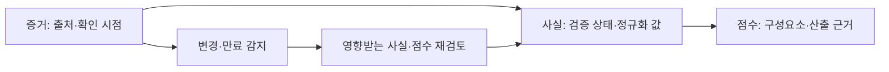

# G밸리창업경진대회 — 본문·통계·공식 서식 보완 (3차: 통계 해석·이식 문안 검수)

- 기준일: 2026-09-26 (**3차 개정**, 통계 해석 및 표현 교체 본문 반영)
- 담당: CMO / 이슈 [DOW-1234](/DOW/issues/DOW-1234) (상위 [DOW-1154](/DOW/issues/DOW-1154))
- 대상: 제10회 G밸리창업경진대회, 접수 마감 2026-10-08(목) 17:00
- 성격: **보완본**이다. 제출·접수·외부 발송·서명은 이 문서로 실행하지 않는다.
- 기준 초안: `docs/business-development/20260924_gvalley_10th_startup_competition_application_package.md`

---

## 0. 이번 회차 결과 요약

| 위임 항목 | 결과 |
|---|---|
| 공개 통계 4건 원문·기준연도·정의 대조 | **4건 전부 확정 (자리표시자 0개).** 초안이 지정한 출처 2건은 값이 나오지 않아 교체했고, 교체 출처에서 원문 확보까지 완료 |
| 경쟁사 일반화·유일성 표현 수정 | **9곳 이식용 본문 작성 및 재검수** (2장) |
| 5.2 수상·정부과제·투자 실적 정정 | **'해당 없음(보드 확인)' → '미확인'** (3장) |
| 공식 첨부 필수서류·분량·PDF 병합·날인 재검증 | **완료. 초안 오류 3건 발견** (4장) |
| 편집 가능한 서식 | **서식1·3·4 기재 시트 작성** (5장) |
| 미충족 항목표 | **작성 완료, 13행(해소 1행 포함)** (6장) |
| 운영사 문의 수신처·문안 | **수신처 확정 + 발송 가능한 전문 작성. 미발송** (7장) |

**가장 중요한 발견 세 가지.**

0. (2차 추가) **국토교통부 통계는 포털 화면이 아니라 보도자료 첨부 PDF에서 받는다.** `www.molit.go.kr` 리디렉션 루프와 KOSIS 스크립트 화면 때문에 사업개발이 막혀 있던 수치 2·3을, 정책브리핑(korea.kr) 보도자료 첨부 PDF에서 **인증키 없이** 전부 확보했다. 지역 구분·누계 구분·정의가 한 페이지에 함께 명시되어 대조 품질도 더 높다(1-2절, 재현 스크립트 커밋 완료).

1. 초안의 통계 출처 하나가 **존재하지 않는 자료를 가리키고 있었다.** 인구주택총조사 등록센서스에는 점유형태(자가/전세/월세) 항목이 없다. 10월 초에 "출처를 찾을 수 없다"로 막혔을 구간이다(1-1절).
2. 서식4 대표자 서약서의 서약 조항은 **6개가 아니라 7개**였다. 초안이 누락한 1개는 "운영사의 만족도 설문 및 실적조사에 성실히 응한다"로, 대회 종료 이후까지 의무가 이어지는 조항이다. 보드가 날인 전에 읽어야 한다(4-1절).

---

## 1. 통계 및 해석 — 3차 검수 반영

[시장 통계 출처 대장 3판](/DOW/issues/DOW-1154#document-market-statistics)의 2026-09-26 원문 재대조 결과를 적용했다. 이번 회차는 새 원문 조사 대신 검수된 수치와 해석을 본문에 이식했다. 기존 1~2장의 문안은 아래 내용으로 대체한다.

### 1-1. 서식2 1.3에 이식할 본문

국토교통부 「2024년도 주거실태조사」에 따르면 2024년 전국 가구의 임차 비율은 38.0%, 수도권은 44.4%다. 이는 가구 기준 표본조사 결과다.

국토교통부 「'25년 12월 주택통계」의 2025년 연간 주택 전월세 거래 집계는 전국 2,791,795건, 수도권 1,858,866건이다. 임대차 신고 및 확정일자 부여 신고건 기준이며 국가승인통계는 아니다. 같은 집계에서 수도권 전월세 거래 중 월세 비중은 61.8%, 수도권 비아파트는 73.5%다. 거래 비중을 가구 비중이나 계약 기간으로 해석하지 않는다.

대한법률구조공단의 2025년 주택임대차분쟁조정 신규 접수는 1,812건이며 임차인 신청이 1,542건(85.1%)이다. 보증금 또는 주택의 반환 유형은 924건(51.0%)이다. 이는 해당 기관의 접수 실적으로 전국 모든 분쟁 또는 피해 규모가 아니다. 반환 분쟁 중 사진·상태 기록으로 해결 가능한 비율도 이 표로는 알 수 없다.

입주해는 거주 경험과 입주 당시 상태 기록을 정리하는 기능이 이용자의 정보 확인에 도움이 되는지 검증하고자 한다. 분쟁 감소 효과와 공급자의 지불 의사는 향후 검증할 사업 가설이다.

### 1-2. 집필·도표에 공통 적용할 제한

- 2025년 주택 거래 집계는 1~12월 누계·신고일 기준이다. 월세에는 보증부월세·반전세를 포함한다. 국가승인통계가 아니며 거래 건수는 가구 수·매출 규모와 다르다.
- 수도권 비아파트 73.5%는 해당 집계의 유형 전체 값이다. 원룸·오피스텔만의 비중으로 표시하지 않는다. 월세 비중으로 짧은 계약 기간이나 이사 주기를 추론하지 않는다.
- 2024년 임차가구 현재주택 평균 거주기간 3.6년은 이사 주기가 아니다. 첫 독립 1~3년차 고객군은 검증할 가설이다.
- 2025년 접수 1,812건과 처리 1,759건은 모집단이 다르다. 처리에는 전년 접수 사건이 포함된다. 각하 813건을 신규 접수로 나눈 44.9%와 조정성립 205건을 신규 접수로 나눈 11.3%는 결과 확률로 사용하지 않는다.
- 각하 사유별 건수가 없어 전체 각하를 상대방의 조정 거부로 볼 수 없다. 화해취하 등도 있어 조정성립 이외 처리를 모두 해결 실패로 볼 수 없다.
- 임차인 신청 85.1%는 손실·피해액·책임 비중이 아니다. 반환 유형 51.0%는 보증금 미반환만의 비중이 아니며, 사진·기록으로 해결할 수 있는 비중도 아니다.
- 5년 평균은 특정 연도의 관측치가 아니다. 서로 다른 누계 기간을 연결한 추세 문장을 사용하지 않는다.

### 1-3. 유형별 합계 확인

출처 대장 3판의 11개 유형: 924 + 242 + 209 + 155 + 107 + 53 + 15 + 9 + 1 + 0 + 97 = **1,812건**. 누락됐던 기타 97건과 표준계약서 사용 0건을 포함한다. 구성비는 반올림으로 합계가 100%와 다를 수 있다.

원문 위치: 거래 집계는 [국토교통부 보도자료](https://www.korea.kr/briefing/pressReleaseView.do?newsId=156742136) 첨부 PDF 11~12쪽, 분쟁 접수는 [공단 실적표](https://www.hldcc.or.kr/hp/li/statHldccRetunDetail.do). 주거실태조사 근거와 재대조 이력은 출처 대장 1장을 따른다.

## 2. 경쟁사·유일성·사업 효과 표현 — 이식용 개정 본문

아래는 기존 교체표 9건의 대체 문안이다. 상위 신청 패키지는 사업개발이 통합한다. 기존 대안에 남아 있던 ‘표준화되어 있지 않다’, ‘같은 시간이 필요하다’ 등 무근거 일반화도 제거했다.

### 2-1. 서식2 1.2 문제 정의 (기존 1~4번 교체)

임차인은 매물과 거주 경험에 관한 정보를 확인할 때 작성 주체, 확인 시점, 근거 자료를 함께 살펴볼 필요가 있다. 입주해는 이 정보를 정리해 이용자의 확인을 돕는 방식을 검토한다. 작성자의 거주 확인과 정보 출처 표시가 후기 판단에 도움이 되는지는 이용자 검증으로 확인할 예정이다.

임차인 무료 이용을 기본 사업 가설로 두고, 공급자에게 검증 정보의 가치를 제공하는 수익모델을 검토한다. 공급자의 지불 의사와 검증 비용을 확인하기 전에는 수익성을 확정하지 않는다. 사후 분쟁 접수 통계는 관측된 신청 규모를 설명하는 자료이며, 입주해의 사전 기록 기능이 분쟁을 줄인다는 인과 근거는 아니다.

### 2-2. 서식2 2.3 차별성 (기존 5~7번 교체)

입주해는 정보의 출처·확인 시점·검증 상태를 함께 보여주는 설계를 지향한다. 아래 항목은 경쟁 서비스의 기능 부재를 주장하는 비교가 아니라 입주해의 설계 목표와 검증 질문이다. 구현·배포·실사용 여부는 [기술 증빙 검증](/DOW/issues/DOW-1235)에서 허용된 범위만 제출본에 반영한다.

| 설계 항목 | 입주해가 검토하는 방식 | 확인할 지표·조건 |
|---|---|---|
| 정보 근거 | 증거 출처와 확인 시점 표시 | 이용자의 근거 확인율·이해도 |
| 후기 | 거주 확인 상태 구분 | 거주 확인 절차의 정확도·제출 부담 |
| 점수 | 구성요소와 산출 근거 설명 | 설명 이해도·오류 정정 가능성 |
| 갱신 | 유효기간과 변경 영향 관리 | 만료·변경 시 처리의 검증 결과 |
| 진입 | 커뮤니티에서 거주 경험 수집 | 4주 재방문율·유효 기록 축적 |
| 수익 | 공급자의 검증 정보 이용 가치 | 지불 의사·전환율·검증 비용 |

축적된 증거의 품질과 다양성이 서비스 가치에 기여하는지 검증한다. 데이터 규모만으로 경쟁우위나 복제 불가능성을 주장하지 않는다. 초기에는 검증 상태를 구분해 안내하는 방식을 검토하되, 공급 참여와 이용자 판단에 미치는 영향을 함께 측정한다. 특허 번호·출원·등록 상태는 증빙 확인 전 미확인으로 두며 차별성의 확정 근거로 사용하지 않는다.

### 2-3. 서식2 3.2 진입 전략 (기존 8번 교체)

커뮤니티에서 거주 경험을 수집하고, 거주 확인 절차를 거쳐 공급자에게 검증 정보의 가치를 제안하는 순서를 초기 실험안으로 둔다. 이용자 참여율, 거주 증거 제출률, 공급자 지불 의사를 단계별로 확인한다. 앞 단계의 지표가 확보되지 않으면 진입 순서와 수익모델을 재검토한다.

### 2-4. 자체점검 및 기술 문구 (기존 9번 교체)

저장소의 개발 산출물은 기술 증빙 검수 결과에 따라 설명한다. 커밋·API·테스트 파일 수는 개발 산출물 지표이며 고객 성과나 운영 안정성을 뜻하지 않는다. 타 참가팀의 개발 단계는 비교 근거로 사용하지 않는다. 기술 검증 전에는 ‘운영 중’, ‘실사용’, ‘모바일 빌드 완료’를 확정하지 않는다.

---

### 2-5. 서식2 도표 원고 2종 — 편집 가능

**도표 1. 증거 확인 설계 개념도 (구현 완료를 뜻하지 않음)**

캡션: 입주해가 지향하는 정보 처리 구조. 실제 구현·빌드·배포 상태는 기술 증빙 검수 결과를 반영해 확정한다. 공공데이터·위치인증 연계는 별도 검토 과제이며 연계 완료를 뜻하지 않는다.

**도표 2. 사업 가설과 검증 지표**

| 검증 질문 | 지표 정의 | 현재 결과 | 판정 전제 |
|---|---|---|---|
| 사용자가 거주 근거를 제출하는가 | 거주 증거 제출 사용자 / 제출 안내 대상 사용자 | 미측정·증빙 미수령 | 동일 기간·중복 제거 기준 확정 |
| 커뮤니티를 다시 이용하는가 | 최초 활동 주 사용자 중 4주 후 활동한 사용자 비율 | 미측정·증빙 미수령 | 활동 정의·관측 기간 확정 |
| 검증 정보가 문의 행동과 관련 있는가 | 검증 상태별 문의 사용자 / 매물 열람 사용자 | 미측정·증빙 미수령 | 가격·지역·노출 차이 통제, 인과 단정 금지 |
| 공급자가 비용을 지불하는가 | 제안 대상 중 실제 유료 전환한 공급자 비율 | 미측정·증빙 미수령 | 가격·환불·시험 이용 구분 |
| 수익성이 성립하는가 | 공급자 매출에서 검증·지원 비용을 뺀 기여이익 | 미측정·증빙 미수령 | 실제 비용·매출 증빙 확보 |

캡션: 목표 수치·효과 크기는 확정하지 않았다. 기간·표본·집계 정의와 함께 관측 결과를 기록한 뒤 사업 가설을 판단한다.

두 도표의 편집 가능한 원고를 제공했다. 공식 HWP에 배치한 뒤 글자 크기·페이지 분량·PDF 렌더링을 확인하는 작업은 사업개발의 통합 단계에 남아 있다.

## 3. 5.2 정정 — '해당 없음' → '미확인'

상위 [신청 패키지](/DOW/issues/DOW-1154#document-application-package)의 정정 기준을 본문에도 반영한다.

| 구분 | 초안 표기 | **정정 후** | 확인 경로 |
|---|---|---|---|
| 수상경력 | 해당 없음 (보드 확인) | **미확인** | 보드. 확인 전까지 서식2 5.2에 아무것도 기재하지 않는다 |
| 정부과제 수행실적 | 해당 없음 (보드 확인) | **미확인** | 보드. **주의: 서식 유의사항 5는 "예비창업패키지 등 정부지원사업을 포함"으로 범위를 넓게 잡는다.** 경진대회·공모전이 아닌 지원사업 참여 이력도 해당할 수 있으므로 확인 질문을 이 범위로 던져야 한다 |
| 투자유치 실적 | 해당 없음 (보드 확인) | **미확인** | 보드 |
| 지식재산권 등록 | 기재 없음 | **기재 없음 (유지)** | 특허 번호·출원 상태는 증빙 대조 전 미확인이며 서식이 "등록완료된 건만 기재"로 명시한다. 상표 등록 건 유무는 **미확인** |

**'없음'과 '미확인'을 구분하는 실무상 이유.** 서식2 유의사항 2는 "서류심사 통과자는 작성 내용에 대한 증빙자료를 건별로 제출"을 요구한다. 없는 것을 '없음'으로 쓰는 것은 문제가 없지만, **확인하지 않은 것을 '없음'으로 쓰면 서약서의 "사실과 다르게 기재"에 해당할 수 있다.** 미확인 항목은 공란으로 두고, 보드 확인 후에만 채운다.

---

## 4. 공식 첨부 재검증 — 필수서류·분량·PDF 병합·날인

원문 2종을 직접 대조했다. 공고문 본문과 지원신청서 서식 원문(서식1~5 전체)이다.

### 4-1. 초안 오류 3건

| # | 초안 기술 | **원문 확인값** | 영향 |
|---|---|---|---|
| 1 | 서식4 서약서 "**6개 항**을 서약한다" | **7개 항**이다. 초안이 누락한 것은 **"경진대회 관련 운영사의 만족도 설문 및 실적조사에 성실히 응할 것"** | 대회 종료 **이후까지** 이어지는 의무다. 보드가 날인 전에 읽어야 할 조항이 하나 빠져 있었다 |
| 2 | 서식3 "제3자 제공처는 **8개 기관**" | **9개**다. 한국산업단지공단, 서울특별시, 금천구, 구로구, 중소벤처기업진흥공단, 신용보증기금, 숭실대학교, KIBA 서울, **비디씨엑셀러레이터** | 개인정보 제공 동의 범위를 보드에 설명할 때 운영사가 빠져 있었다 |
| 3 | 서식5 발급처 "서울지역본부(**입지혁신팀**)" | **공고문과 서식의 기재가 서로 다르다.** 공고문: 서울지역본부(**서울 입주지원팀**) / 서식5 안내: (**입지혁신팀**) | 가점 2점을 포기하면 무관. 추진 시 어느 쪽이 맞는지 확인 필요 → 7장 문의 4 |

### 4-2. 재검증 확인표

| 검증 대상 | 원문 조건 | 초안 일치 | 비고 |
|---|---|---|---|
| **필수서류 (예비창업자)** | 서식1·2·3·4 필수 / 서식5 해당시 / 붙임1·3 예비창업자 **제외** / 붙임2·4 법인만 / 붙임5 **선택** | ✅ 일치 | 예비창업자 경로에서 실제 필수는 **서식1~4** 뿐 |
| **사업계획서 분량** | 최소 **5페이지 이상**, **10페이지 내외 권장**, **최대 15페이지 이내** | ✅ 일치 | 서식2 유의사항 5 |
| **PDF 병합 규칙** | **서식1~5**를 순서대로 **하나의 파일로 스캔**하여 PDF 제출. **붙임1~5는 신청 링크의 해당 항목에 개별 PDF**로 제출 | ✅ 일치 | 공고문 제출서류 표 하단 주석. **단, 서식1 본문의 제출서류 목록은 붙임까지 9개를 나열한 뒤 "위 제출서류를 순서대로 하나의 파일로"라고 적어 공고문과 다르게 읽힐 여지가 있다.** 공고문 규칙(서식만 병합)을 따르되 7장 문의 3으로 확인 |
| **미준수 제재** | "제출서식 미준수 시 **서류심사 대상에서 제외**될 수 있음" | ✅ 일치 | 패키징이 곧 자격 요건 |
| **날인 — 서식1** | **회사직인 필수 (예비창업자는 본인날인 필수)** | ✅ 일치 | 공고문 제출서류 표 비고란 |
| **날인 — 서식3** | 기업명·대표자 **(인)** + 동의 체크 **2곳** | ✅ 일치 | 수집·이용 동의 / 제3자 제공 동의 |
| **날인 — 서식4** | 기업명·대표자 **(인)** | ✅ 일치 | |
| **작성 유의사항** | "객관적 자료에 근거하여 논지를 전개하되, 시장 및 기술동향, 선행기술 및 경쟁제품 검토 시 **객관적인 데이터 및 출처 제시** 요망" | — | **2장 표현 교체의 근거가 이 조항이다.** 출처 없는 경쟁제품 단정은 유의사항 위반 |
| **이미지 사용** | "창업아이템의 효과적 설명을 위한 이미지 사용을 **권장**" | ⚠️ 미충족 | 2-5절 도표 원고 2종 작성, 공식 서식 배치 확인 대기 |
| **주요인원 프로필** | 대표자 포함 **5인 이내** | ✅ | |
| **경력 기재** | "경력별 시기(연도 등) **반드시 포함**" | ✅ | |
| **보유기간** | 개인정보 보유기간 **5년** (제3자 제공분은 목적 달성 후 폐기) | ✅ 일치 | |

### 4-3. 문의로 던지려던 것 중 1건은 원문에 답이 있었다

초안 8장 질의 2는 "예비창업자의 서식1 기업명란에 대표자 성함을 쓰는 것이 맞는지"였다. **서식1 원문 기업명란에 "(예비창업자인 경우 대표자 성함 기재)"가 이미 적혀 있다.** 문의 불필요.

다만 **본사 주소란은 "(사업자등록증 기준)"으로만 안내되어 있고** 예비창업자는 사업자등록증이 없다. 이 부분은 여전히 미해소이므로 문의에 남긴다(7장 문의 2).

---

## 5. 편집 가능한 서식 기재 시트

공식 HWP 내부 초안 편집과 PDF 출력은 CMO 담당이다. 대표자 정보 입력·동의 선택·날인은 보드 담당으로 분리한다. 아래는 **이식용 기재 시트이며 공식 편집 완료본이 아니다**. 원본과 편집 환경 점검은 [공식 서식 점검](/DOW/issues/DOW-1234#document-form-readiness)을 따른다. 확정값은 채웠고, 보드 입력값은 빈칸과 입력 지침으로 남겼다. 민감정보는 이 문서에 적지 않는다.

### 5-1. 서식1 지원신청서 기재 시트

| 항목 | 기재값 | 상태 |
|---|---|---|
| 신청 기업명 | `(예비창업자 → 대표자 성함)` | 보드 입력. 서식 지시에 따라 성함 기재 |
| 사업 아이템 (한 줄 이내) | **거주 경험과 입주 상태 기록의 근거 확인을 돕는 임대차 서비스 「입주해」** | 제안 문안·CTO 판정 후 확정 |
| 구분 | ☐ 예비창업자 ☐ 개인사업자 ☐ 법인사업자 | 보드 확정 ([프로필](/DOW/issues/DOW-1090#document-profile) 값 1) |
| 기술분야 | ☑ **기타** | ✅ 확정. 제시 4개 분야(AI 제조자동화·로봇 자동화·친환경/탄소중립·스마트 물류) 중 해당 없음. 공고가 "全 분야"를 명시하므로 기타 선택이 맞다 |
| 대표자 성명 / 생년월일 | | 보드 직접 입력 (문서에 미기재) |
| 웹사이트 / SNS 주소 | 서비스 URL + 저장소 URL | 보드 확인 후 기재 |
| 사업자등록번호 | 예비창업자면 **미기재** | 서식이 "없을 시 미기재" 명시 |
| 설립일 | 예비창업자면 **미기재** | 동일 |
| 직원 수 | | 보드 ([프로필](/DOW/issues/DOW-1090#document-profile) 값 6) |
| 기업 본사 주소 | | 보드. **예비창업자 기재 기준 미확인 → 문의 2** |
| 대표자 연락처 / e-mail | | 보드 직접 입력 |
| 담당자 연락처 / e-mail | | 대표자와 동일 시 동일 기재 |
| 제1~9회차 수상 여부 | ☐ 미확인 | 보드가 수상 이력 확인 후 선택 |
| 작성일 / 기업명 / 대표자 (인) | 2026년 __월 __일 | **날인 — 보드 실행** |

### 5-2. 서식3 개인정보 수집·이용 동의서 기재 시트

| 항목 | 값 | 상태 |
|---|---|---|
| 소속 | 기업명(예비창업자는 성함) | 보드 |
| 성명 / 생년월일 / 연락처 | | 보드 직접 입력 |
| 수집·이용 동의 | ☐ 미선택 | 보드가 내용 확인 후 직접 선택 (미동의 시 참여 제한 명시) |
| 제3자 제공 동의 | ☐ 미선택 | 보드가 내용 확인 후 직접 선택 |
| 작성일 / 기업명 / 대표자 (인) | 2026년 __월 __일 | **날인 — 보드 실행** |

보드 고지 사항: 수집 주체는 **비디씨엑셀러레이터(주)**, 보유기간 **5년**. 제공받는 자는 **9개 기관**(4-1절 #2). 제공 항목은 성명·생년월일·연락처·이메일, 제공 목적은 상금·상장·입주바우처 전달, 제공분 보유기간은 목적 달성 후 폐기.

### 5-3. 서식4 대표자 서약서 — 서약 7개 항 (보드 확인용 전문 요약)

날인 전에 보드가 읽어야 할 항목이다. **입력값은 기업명·대표자·날짜뿐이지만, 서명하는 내용은 아래 7개다.**

| # | 서약 내용 | 보드 확인 포인트 |
|---|---|---|
| 1 | 신청일 현재 참가제외 대상 아님. 사실과 다르면 **선정취소 및 손해배상 등 불이익 처분에 동의** | 참가제외 대상: 중소기업창업 지원법 시행령 제4조 제외업종 / 사행성·환경오염 등 반사회적 아이템 / **동일 아이디어로 1~9회차 수상** / 타인 지식재산권 침해 우려. 4개 모두 보드 확인 필요 |
| 2 | 타인의 아이디어를 도용하지 않음. 모방 시 민·형사 책임 | |
| 3 | 대회 중 공개된 아이디어를 보호받으려면 **공개 이전에 직접 지식재산권을 획득**해야 함을 확인 | 특허 번호·출원 상태는 **증빙 대조 전 미확인**이다. 대회 발표 자료에 어디까지 공개할지 보드 판단 필요 |
| 4 | 타 출품자의 아이디어·기술정보를 사전 서면동의 없이 누설하지 않음 | |
| 5 | 심사 평가방법·절차 및 최종 결과에 **어떠한 이의도 제기하지 않음** | |
| 6 | **경진대회 종료일까지 전 프로그램에 성실히 참여** | 10-21~10-30 액셀러레이팅 + 11-04 데모데이. **보드 결정 2와 직결** |
| 7 | **운영사의 만족도 설문 및 실적조사에 성실히 응함** | **초안 누락 항목.** 대회 종료 이후까지 의무가 이어진다 |

---

## 6. 미충족 항목표

제출 가능 상태까지 남은 것 전부다. '차단'은 없으면 접수할 수 없는 것, '감점'은 접수는 되지만 점수를 잃는 것이다.

| # | 항목 | 등급 | 현재 상태 | 해소 조건 | 담당 | 기한 |
|---|---|---|---|---|---|---|
| 1 | 응모 여부 결정 | **차단** | 미결정 | 보드 판단 | 보드 | 09-30 |
| 2 | 10-21~10-30 + 11-04 참여 가능 여부 | **차단** | 미결정 | 불가 시 서식4 날인 불가 → 접수 중단 | 보드 | 09-30 |
| 3 | 서식1 기업형태 구분 | **차단** | 미확인 | [프로필](/DOW/issues/DOW-1090#document-profile) 값 1 확정. 값에 따라 붙임 구성이 바뀜 | 보드 | 10-01 |
| 4 | 대표자 성명·생년월일·연락처·주소·직원수 | **차단** | 미확인 | 최종 서식에 직접 입력 | 보드 | 10-05 |
| 5 | 서식2 4장 대표자·참여인력 경력 (배점 20) | **차단** | 공란 | 연도 포함 경력 기재. 대체 불가 | 보드 | 10-05 |
| 6 | 서식1·3·4 날인 | **차단** | 미실행 | 회사직인 또는 본인날인 | 보드 | 10-06 |
| 7 | 서식1~4 단일 PDF 병합 | **차단** | 미실행 | 순서대로 스캔·병합 | 보드+사업개발 | 10-06 |
| 8 | 통계 수치 1~4 | ~~감점~~ | **해소 (09-26)** | 4건 전부 원문 확정, 자리표시자 0개. 1-1·1-3절 참조 | CMO·사업개발 | 완료 |
| 9 | 성장전략 실적 수치 (배점 30) | **감점 최대** | 공란 | 초기 사용자 수·검증 건수 등 공개 범위 결정 | 보드 | 10-03 |
| 10 | 서식2 이미지·도표 | 감점 | 원고 2종 완료·HWP 배치 대기 | 공고가 이미지 사용 권장. 신뢰 엔진 계층도 1개 + 지표 표 1개 최소 | CMO | 10-03 |
| 11 | 기술·운영 주장 증빙 | 감점 | 진행 중 | 주장별 기준일·증빙 경로·허용 문구 | CTO / [DOW-1235](/DOW/issues/DOW-1235) | 09-30 |
| 12 | 서식5 (가점 2점) | 해당 시 가점 | 미확인 | G밸리·보육시설 입주 사실이 있으면 확인서 발급. **현재 미확인** | 보드 | 10-01 |
| 13 | 붙임5 IR 자료 (선택) | 선택 | 미작성 | 제출 여부 결정 | 보드 | 10-05 |

> 12번에 대한 보완. 초안은 서식5를 "해당 없음"으로 단정했다. 공고문은 "**보육시설 입주기업은 운영기관 발급 확인서(양식 자유)**"도 인정한다. 창업보육센터·지원센터 입주 이력이 있으면 가점 2점을 받을 수 있다. **'해당 없음'이 아니라 '미확인'이 맞다.** 프로필 확인 항목에 포함한다.

---

## 7. 운영사 문의 — 수신처와 발송 가능한 문안

**발송하지 않았다.** 보드 실행 승인 후에만 보낸다.

### 7-1. 수신처

| 구분 | 수신처 | 용도 |
|---|---|---|
| **1순위 (접수·운영)** | **비디씨엑셀러레이터(주)** / `startup@bdcaccelerator.co.kr` / 031-706-8133 | 공고문 「지원문의」의 접수·운영 문의 창구. 아래 문안의 수신처 |
| 2순위 (그 외) | 한국산업단지공단 서울지역본부 / 070-8895-7304 | 서식5 발급 등 공단 소관 사항 |

### 7-2. 문의 항목 (4건 → 4건 유지, 1건 교체)

초안 질의 2의 전반부(기업명 기재)는 서식 원문에서 해소되어 삭제했고, 대신 PDF 병합 범위 불일치(4-2절)를 추가했다.

### 7-3. 발송 가능한 문안 — 이메일

> **받는 사람:** startup@bdcaccelerator.co.kr
> **제목:** [2026 제10회 G밸리창업경진대회] 예비창업자 신청 관련 문의 4건
>
> 안녕하세요.
>
> 「2026년 G밸리창업경진대회」(공고 제2026-09-18호) 참가를 준비하고 있습니다. 공고문과 지원신청서 서식을 확인했으나 아래 4가지가 명확하지 않아 문의드립니다. 신청서 작성 및 제출 형식과 직접 관련된 사항이라 접수 전에 확인이 필요합니다.
>
> **1. 액셀러레이팅 및 데모데이의 진행 방식**
> 10월 21일~30일 액셀러레이팅(1:1 멘토링, 모의 IR)과 11월 4일 데모데이가 대면인지 비대면인지, 대면이라면 장소와 회차별 예상 소요시간을 알 수 있을까요. 서식4 대표자 서약서에 전 프로그램 성실 참여 조항이 있어, 참여 가능 여부를 미리 판단하고자 합니다.
>
> **2. 예비창업자의 기업 본사 주소 기재 기준**
> 서식1의 기업 본사 주소란은 "(사업자등록증 기준)"으로 안내되어 있는데, 예비창업자는 사업자등록증이 없습니다. 이 경우 거주지 주소를 기재하면 되는지, 또는 미기재해도 되는지 확인 부탁드립니다.
>
> **3. 제출 파일 병합 범위**
> 공고문 제출서류 표의 주석에는 "서식 1~5를 순서대로 하나의 파일로 스캔하여 PDF로 제출하고, 붙임 1~5는 개별 PDF로 제출"로 안내되어 있습니다. 다만 서식1 본문의 제출서류 목록은 붙임 1~5를 포함한 9개 항목을 나열한 뒤 "위 제출서류를 순서대로 하나의 파일로"라고 적혀 있어 두 안내가 다르게 읽힙니다. **서식만 병합하고 붙임은 개별 제출하는 것이 맞는지** 확인 부탁드립니다.
>
> 아울러 병합 PDF는 출력 후 재스캔한 파일이어야 하는지, 아니면 **전자서명·전자날인이 적용된 PDF도 인정되는지** 알려주시면 감사하겠습니다.
>
> **4. G밸리 입주 확인서 발급 부서**
> 서식5 관련하여, 공고문에는 한국산업단지공단 서울지역본부 "서울 입주지원팀"으로, 서식 안내문에는 "입지혁신팀"으로 각각 기재되어 있습니다. 실제 발급 부서를 알려주시면 감사하겠습니다.
>
> 바쁘신 중에 번거롭게 해 드려 죄송합니다. 회신 주시면 준비에 반영하겠습니다.
>
> 감사합니다.
>
> (발신자 성명 / 연락처 — 보드 입력)

### 7-4. 전화 문의용 축약본 (031-706-8133)

메일 회신이 늦을 경우를 대비한 통화 스크립트다. 우선순위 순서로 배치했다.

1. "예비창업자로 신청하려는데, 액셀러레이팅과 데모데이가 대면인가요? 대면이면 장소와 1회당 소요시간이 어떻게 되나요?"
2. "제출 PDF는 서식 1~5만 하나로 합치고 붙임은 따로 올리는 게 맞나요?"
3. "전자날인된 PDF도 인정되나요, 아니면 출력해서 스캔해야 하나요?"
4. "예비창업자는 본사 주소란에 뭘 쓰면 되나요?"

---

## 8. 본문 실측 지표 — 재측정 결과와 처리 규칙

초안 2.2의 실측표는 2026-09-24 기준이다. **오늘(09-26) 다시 세었더니 4개 값이 바뀌었다.**

| 지표 | 초안 (09-24) | **재측정 (09-26)** | 측정 방법 |
|---|---|---|---|
| 누적 커밋 | 444 | **493** | `git rev-list --count HEAD` |
| DB 마이그레이션 | 48 | 48 | `db/migration-*.sql` |
| API 엔드포인트 | 136 | **137** | `app/api/**/route.ts` |
| 화면(페이지) | 80 | **79** | `app/**/page.tsx` |
| 자동화 테스트 파일 | 61 | **79** | `__tests__/**/*.test.ts(x)` |
| 신뢰 엔진 전용 테이블 | 23 | 23 | `migration-024-patent-trust-engine.sql` 내 `CREATE TABLE` |
| 개발 기간 | 2026-01-25 ~ | 2026-01-25 ~ 2026-09-26 (8개월) | 최초 커밋일 |

**화면 수는 늘어난 게 아니라 줄었다(80 → 79).** 이틀 사이에도 값이 움직인다는 뜻이다.

처리 규칙 두 가지를 제안한다.

1. **제출본의 실측표는 제출 당일 다시 센다.** 서류심사 통과 시 증빙 제출 의무가 있으므로, 제출일과 측정일이 다르면 증빙 대조에서 값이 어긋난다. 위 측정 명령을 그대로 재실행한다.
2. **본문에는 "2026-00-00 기준"을 표 제목에 명기한다.** 기준일 없는 실측값은 검증할 수 없다.

또한 이 표의 각 값이 **무엇을 증명하는가**는 CMO 판단 범위를 넘는다. "운영 중인 제품"·"실사용" 같은 표현이 허용되는지는 [DOW-1235](/DOW/issues/DOW-1235)의 기술·운영 증빙 판정을 받아 확정한다. 그 전까지 개별 기능의 구현 완료도 단정하지 않고 설계 목표로 표시한다.

---

## 9. 다음 회차 (10-05 검토본까지)

| 순서 | 작업 | 담당 | 기한 |
|---|---|---|---|
| 1 | ~~통계 수치 1·3 확정~~ → **09-26 완료**, 4건 전부 원문 확정 | CMO | 완료 |
| 2 | 2장 표현 교체 9건 이식용 개정 본문 작성 | CMO | **09-26 완료, 상위 통합은 사업개발** |
| 3 | 서식2 도표 원고 2종 작성, HWP 배치 검수는 통합 단계 | CMO 편집·사업개발 검수 | **09-26 원고 완료, 10-03 HWP·10-05 PDF 대기** |
| 4 | [DOW-1235](/DOW/issues/DOW-1235) 증빙 판정 수령 → 기술 문구 확정 | CMO ← CTO | 10-03 |
| 5 | 보드 입력값 수령 → 서식1·2 완성 | 사업개발 ← 보드 | 10-05 |
| 6 | 검토본 제출 | CMO → 사업개발 | **10-05** |

**차단 요인은 통계가 아니라 보드 결정이다.** 6장 미충족표의 차단 등급 7건 중 6건이 보드 입력이고, 그중 2건(응모 여부, 일정 참여 가능 여부)은 09-30까지 결정되지 않으면 나머지 작업이 의미를 잃는다.
