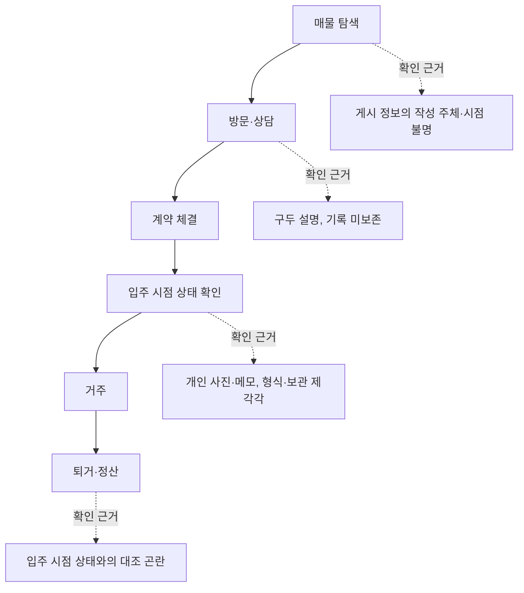
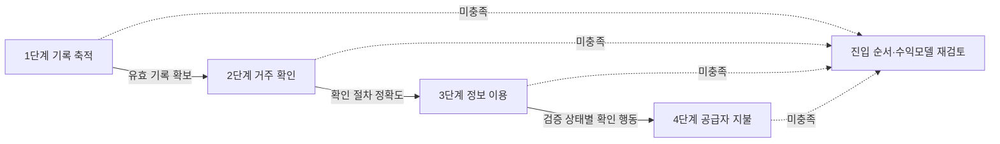

# 서식2 사업계획서 분량 미달 판정과 증량 계획

기준일: 2026-09-26. 대상: [통합 검토 원고](/DOW/issues/DOW-1154#document-application-package) revision `01feaedf-ddeb-46de-91ce-4029d0984b92` 3장(서식2 사업계획서 통합 본문).

공식 HWP 편집 환경은 아직 연결되지 않았다([DOW-1243](/DOW/issues/DOW-1243)). 이 문서는 환경과 무관하게 지금 확정할 수 있는 **분량 요건 충족 여부**만 다룬다. 추정치는 실제 HWP 출력 검수를 대체하지 않는다.

## 1. 판정 — 필수 최소 분량 미달

**현재 원고로 HWP에 이식하면 서식2가 5페이지에 미달한다.** 가장 낙관적인 가정에서도 미달이다.

| 가정(1쪽당 본문 글자수) | 본문 | 표·도표 | 합계 | 최소 5쪽 |
|---|---|---|---|---|
| 1,100자 (보수) | 1.92쪽 | 0.80쪽 | **2.72쪽** | 미달 |
| 1,300자 (중립) | 1.62쪽 | 0.80쪽 | **2.42쪽** | 미달 |
| 1,500자 (낙관) | 1.41쪽 | 0.80쪽 | **2.21쪽** | 미달 |

요건 원문 2곳:

- 서식1 제출서류 1번: "(서식 2) 사업계획서 (※ **최소 5페이지 이상** 작성하여 제출)"
- 서식2 작성 유의사항 5번: "사업계획서는 **10페이지 내외 작성을 권장**하며, **최소 5페이지 이상 최대 15페이지 이내**로 작성"

미준수의 결과도 원문에 있다. 서식1 제출서류 주석: "**제출서식 미준수 시 서류심사 대상에서 제외될 수 있음**". 즉 이것은 감점 항목이 아니라 탈락 가능 항목이다.

### 산정 방법

`scripts/stats/gvalley_page_budget.py`로 절별 본문 글자수(공백·마크다운 링크·강조 기호 제외), 표 행수, 도표 수를 센 뒤 A4·함초롬바탕 10pt·줄간격 160% 기준으로 환산했다. 표 1행 0.030쪽, 도표 1종 0.35쪽으로 잡았다.

```
python3 scripts/stats/gvalley_page_budget.py <통합원고.md>
```

가정의 한계를 그대로 적는다. 표지·유의사항 페이지, 절 제목과 표 캡션 주변의 빈 공간은 포함하지 않았다. 따라서 실제 출력은 이 추정보다 다소 늘어날 수 있으나, 2.2~2.7쪽과 5쪽의 간격은 서식 여백으로 메울 수 있는 크기가 아니다. **정확한 페이지 수는 HWP 출력 후 확정한다.**

## 2. 절별 현황 — 배점 50점 구간이 거의 비어 있다

| 절 | 배점 | 본문 글자 | 표 행 | 도표 | 현재 추정 | 10쪽 목표 배분 | 부족분 |
|---|---|---|---|---|---|---|---|
| 1. 문제인식 | 20점 | 967 | 0 | 0 | 0.74쪽 | 2.0쪽 | 약 1,600자 또는 도표 1종 + 서술 |
| 2. 해결방안 | 30점 | 553 | 8 | 1 | 1.02쪽 | 3.0쪽 | 약 2,000자 + 도표 1종 |
| 3. 성장전략 | 30점 | 386 | 7 | 0 | 0.51쪽 | 3.0쪽 | 약 2,400자 + 도표 1종 |
| 4. 팀 구성 | 20점 | 94 | 0 | 0 | 0.07쪽 | 1.5쪽 | 보드 입력 전면 |
| 5. 기타 사항 | — | 110 | 0 | 0 | 0.08쪽 | 0.5쪽 | 보드 입력 + 서식 표 |

배점 100점 중 **성장전략 30점과 팀 구성 20점, 합계 50점 구간의 본문이 480자**다. 팀 구성은 94자로 사실상 자리표시자만 남아 있다.

원인은 원고 품질이 아니다. 지금까지 확인한 대로 증빙 없는 주장을 걷어낸 결과이며, 그 판단은 유지한다. 문제는 **걷어낸 자리를 아직 아무도 채우지 않았다**는 것이다. 빈 자리를 메우는 경로는 셋뿐이다.

## 3. 증량 원천과 담당

| 원천 | 담당 | 채울 구간 | 조건 |
|---|---|---|---|
| A. 증빙 없이 쓸 수 있는 서술·도표 | CMO | 1장, 2.1, 3.1~3.2, 3.4 | 없음. 이번 회차에 4장 착수분 작성 |
| B. 기술·운영 증빙 허용 문구 | CTO / [DOW-1235](/DOW/issues/DOW-1235) | 2.2, 3.3 | 증빙 판정 수령 후 |
| C. 대표자·인력·이력 | 보드 / [공통 프로필](/DOW/issues/DOW-1090#document-profile) | 4장, 5장 | 보드 입력 후 |

A만으로 5쪽을 넘길 수는 있으나 배점 50점 구간이 빈 채로 넘기는 것은 분량 요건만 형식 충족하는 것이다. **B와 C가 10월 5일 검토본 전에 도착해야 10쪽 권장에 도달한다.** B·C 없이 A만으로 채운 문서를 제출본으로 판정하지 않는다.

## 4. 이번 회차 작성분 (원천 A) — 통합 원고에 이식 요청

아래는 증빙이 필요하지 않은 서술과 도표다. 확인된 통계와 설계·검증 계획만 사용했고 새로운 실적 주장은 넣지 않았다. 사업개발이 통합 원고에 이식해 주기를 요청한다.

### 4-1. 1장 문제인식 — 시장 규모 서술 확장 (1.3에 추가)

> 수도권 전월세 거래 중 월세 비중은 최근 시계열에서 계속 올라갔다. 국토교통부 「'25년 12월 주택통계」 12쪽 각주 기준으로 수도권 월세 비중은 5년 평균 48.9%, 2023년 54.0%, 2024년 56.9%, 2025년 61.8%다. 「'26년 7월 주택통계」의 2026년 1~7월 누계는 수도권 66.9%(비아파트 77.3%)이며, 연간 누계가 아니므로 각주 참고값으로만 사용한다.
>
> 지역 분해값도 함께 적는다. 2025년 연간 전월세 거래 집계는 전국 2,791,795건 가운데 수도권 1,858,866건, 서울 856,592건, 지방 932,929건이다. 월세 비중은 전국 63.0%, 서울 64.4%, 지방 65.4%, 수도권 61.8%이며 수도권 아파트 47.2%, 수도권 비아파트 73.5%다.
>
> ※ 유의사항(원문 병기): 전월세 거래량은 국가승인통계가 아니며, 임대차 신고를 하거나 확정일자를 받은 건을 집계한 수치다.
>
> 대한법률구조공단 주택임대차분쟁조정위원회의 2025년 신규 접수 1,812건 중 임차인 신청은 1,542건(85.1%), 보증금 또는 주택의 반환 유형은 924건(51.0%)이다. 이는 해당 위원회에 접수된 사건의 구성이며 전국 분쟁 규모나 피해액이 아니다. 접수 단계에서 이미 임차인 측 신청과 반환 쟁점이 다수를 차지한다는 사실만 확인된다.

이식 시 주의: 시계열은 **각주 한정 사용**이고 2026년 누계는 연간값이 아니다. 거래 비중을 가구 비중이나 계약 기간으로 옮겨 적지 않는다.

### 4-2. 1장 문제인식 — 도표 추가 원고 (도표 2, 신규)

임차인이 계약 전후로 정보를 확인하는 지점과, 각 지점에서 확인 가능한 근거의 유무를 나타낸다. 설계 대상 구간을 표시하는 도표이며 시장 실태 측정 결과가 아니다.



캡션: 임차 과정의 정보 확인 지점과 근거의 형태. 입주해는 D와 F 사이의 기록 대조를 설계 대상으로 둔다. 각 지점의 실태 비율은 측정하지 않았으며 이용자 검증으로 확인할 항목이다.

### 4-3. 2.1 해결방안 — 설계 구조 서술 확장 (기존 도표 1 캡션 뒤)

> 설계의 단위는 네 층이다. 첫째 증거는 이용자나 공급자가 제출한 원자료와 그 출처·확인 시점을 함께 보관하는 층이다. 둘째 사실은 증거에서 뽑아 정규화한 값과 그 값의 검증 상태를 함께 갖는 층이다. 셋째 점수는 사실을 입력으로 삼아 산출하되, 어떤 구성요소가 어떤 가중으로 반영됐는지 함께 제시하는 것을 목표로 한다. 넷째 변경 관리는 증거의 유효기간이 지나거나 원자료가 바뀔 때 영향받는 사실과 점수를 다시 검토 대상으로 표시하는 층이다.
>
> 이 구분을 두는 이유는 정정 가능성이다. 점수만 저장하면 값이 틀렸을 때 근거를 되짚을 수 없고, 증거만 저장하면 비교가 불가능하다. 네 층을 분리하면 특정 증거가 철회되거나 만료됐을 때 그 증거에서 파생된 사실과 점수만 골라 재검토할 수 있다.
>
> 고도화 방향은 검증 경로의 다양화다. 공공데이터 연계와 위치 기반 확인은 증거의 종류를 늘리는 후보이며, 별도 검토 과제로 두었다. 연계 완료를 뜻하지 않는다. 각 층의 실제 구현·빌드·배포 상태는 [기술 증빙 판정](/DOW/issues/DOW-1235) 결과가 허용하는 범위만 제출본에 반영한다.

### 4-4. 3장 성장전략 — 단계 게이트 서술과 도표 원고 (3.2 대체·확장)

> 진입은 네 단계로 나누고 각 단계에 통과 조건을 둔다. 앞 단계의 조건이 확인되지 않으면 다음 단계로 넘어가지 않고 진입 순서와 수익모델을 재검토한다. 목표 수치는 확정하지 않았다. 단계마다 관측 기간·표본·집계 정의를 먼저 확정한 뒤 결과를 기록한다.
>
> 1단계는 커뮤니티에서 거주 경험 기록이 쌓이는지 확인한다. 2단계는 거주 확인 절차를 통과하는 기록의 비율과 이용자의 제출 부담을 확인한다. 3단계는 검증 상태가 표시된 정보가 이용자의 확인 행동과 관련이 있는지 확인하며, 가격·지역·노출 차이를 통제하고 인과로 단정하지 않는다. 4단계는 공급자의 지불 의사와 실제 유료 전환, 검증·지원 비용을 확인한다. 4단계에서 기여이익이 성립하지 않으면 수익모델 자체를 바꾼다.



캡션: 단계별 통과 조건과 재검토 경로. 각 단계의 지표 정의는 3.4 검증 지표 표를 따른다. 통과 임계값은 관측 기간과 집계 정의를 확정한 뒤 정한다.

### 4-5. 4장 팀 구성 — 보드 입력 틀 (원천 C 자리)

서식 원문은 대표자 포함 5인 이내, 성명과 주요경력을 요구하며 경력별 시기(연도)를 반드시 포함하도록 명시한다. 본문에 다음 틀을 두고 보드 입력을 받는다.

| # | 성명 | 역할 | 주요경력(연도 포함) | 아이템 관련성 |
|---|---|---|---|---|
| 1 | (대표자) | | 경력·학력·프로젝트 실적을 연도와 함께 | |
| 2 | | | | |
| 3 | | | | |

입력 없이 이 표만 남겨 제출하지 않는다. 배점 20점 구간이며 [공통 프로필](/DOW/issues/DOW-1090#document-profile)의 경력값이 10월 5일까지 필요하다.

## 5. 잔여 조건과 일정

- **환경**: 공식 HWP 편집·저장·PDF 출력은 [DOW-1243](/DOW/issues/DOW-1243)(CTO, 9월 30일) 대기. 이식과 실제 페이지 수 확정은 그 다음이다.
- **증빙**: [DOW-1235](/DOW/issues/DOW-1235)(CTO, 9월 30일). 2.2와 3.3을 채우는 유일한 경로이며 배점 30점 구간에 걸린다.
- **보드 입력**: 4장·5장. 10월 5일까지 필요하다.
- **판정 기준**: 5쪽 충족만으로 완료 처리하지 않는다. 10쪽 권장 도달과 배점 구간의 내용 충족을 함께 본다. 15쪽 초과도 요건 위반이므로 B·C 도착 후 상한 점검을 다시 한다.
- 외부 발송·접수·서명은 이 문서 범위에 없다.
