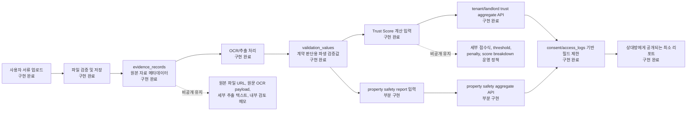
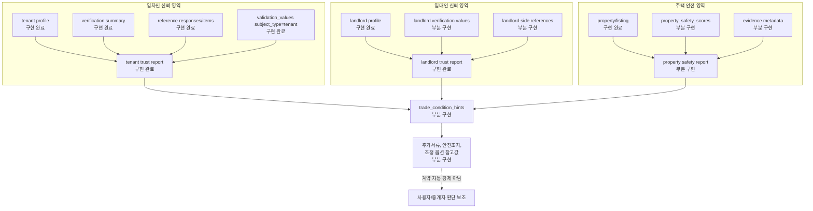
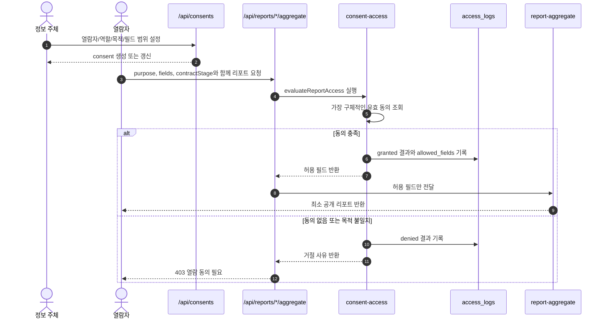
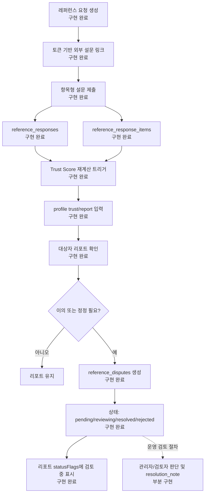

# 입주해 특허 출원 보강용 기술 도면 패키지

작성일: 2026-07-10  
용도: 법무/IP 검토용 비밀정보 제거본 초안  
관련 티켓: [DOW-304](/DOW/issues/DOW-304)

## 공개 기준

이 문서는 특허 정규출원 보강을 위한 구조 설명용 초안이다. 실제 운영 DB, 사용자 식별정보, 원본 파일 URL, API key, OCR prompt 전문, Trust Score 세부 배점, threshold, penalty, SQL query, index 세부값은 제외했다.

표기 기준:

- 구현 완료: 현재 코드와 migration에 직접 근거가 있는 영역
- 부분 구현: 저장 구조나 API 경로는 있으나 자동 산정/운영 UI가 제한적인 영역
- 확장 실시예: 특허 명세서에는 실시예로 표현할 수 있으나 현재 구현 완료로 말하면 안 되는 영역

## 도면 1. 원본 서류에서 선택 공개 리포트까지의 데이터 흐름



핵심 설명:

- 원본 서류는 `evidence_records`에 보관되는 원본 자료 영역이고, 상대방에게 직접 공개되는 대상이 아니다.
- 계약 판단에 필요한 값은 `validation_values`로 분리되어 리포트 입력에 사용된다.
- 리포트 API는 요청 목적과 동의 범위에 따라 공개 필드를 제한하고 `access_logs`를 남긴다.
- `property_safety_scores`와 property safety aggregate API는 별도 주택 안전 리포트로 두고, profile trust에 자동 보정되는 구조는 확장 실시예로 표현한다.

## 도면 2. 임대인·임차인·주택 3분리 산정 구조



핵심 설명:

- 임차인, 임대인, 주택은 같은 단일 점수로 합치지 않고 별도 리포트 대상으로 표현한다.
- `trade_condition_hints`는 세 영역의 결과를 조합한 참고값 저장/조회 구조이며, 보증금·월세를 자동 확정하는 규칙 엔진으로 표현하지 않는다.
- 임대인 권리관계 자동조회, 등기부·건축물대장·시세 자동 판정, feedback learning은 확장 실시예로만 표시한다.

## 도면 3. 동의 기반 선택 공개 및 열람로그 sequence



핵심 설명:

- 접근 제어 판단은 리포트 생성 전에 수행한다.
- 동의가 충족되어도 `allowed_fields`에 포함된 필드만 리포트 빌더에 전달된다.
- contact 정보는 별도 `can_view_contact` 플래그가 있어야 공개된다.
- 허용과 거절 모두 `access_logs`에 남겨 사후 감사와 분쟁 대응 근거로 사용한다.

## 도면 4. 항목형 레퍼런스와 반론·정정 흐름



핵심 설명:

- 레퍼런스는 단순 자유서술이 아니라 항목형 점수와 항목 코멘트를 별도 저장할 수 있다.
- 대상자는 특정 응답 또는 항목에 대해 correction, objection, appeal 유형의 요청을 남길 수 있다.
- 미해결 분쟁은 리포트에서 “검토 중” 상태로 반영된다.
- 관리자 판단 절차와 자동 조정 정책은 운영 프로세스/확장 실시예로 분리한다.

## 구현 근거 표

| 영역 | 구현 상태 | 코드/스키마 근거 | 법무/IP 공개 문구 권장 |
| --- | --- | --- | --- |
| 원본 자료와 파생 검증값 분리 | 구현 완료 | `db/migration-022-patent-trust-engine.sql`, `app/api/verifications/documents/route.ts` | “원본 서류를 직접 공개하지 않고 계약 판단에 필요한 최소 검증값으로 변환한다.” |
| OCR 기반 검증값 생성 | 구현 완료 | `app/api/verifications/documents/route.ts`, `lib/ocr-pipeline.ts` | “업로드 문서에서 확인 항목을 추출하고 검토 상태를 부여한다.” |
| Trust Score 계산 | 구현 완료 | `lib/trust-score.ts`, `lib/trust-score-recalculator.ts` | “복수 확인 항목을 종합해 신뢰 참고값과 상태 신호를 산출한다.” |
| 임차인/임대인 trust aggregate API | 구현 완료 | `app/api/reports/tenant-trust/[id]/aggregate/route.ts`, `app/api/reports/landlord-trust/[id]/aggregate/route.ts`, `lib/report-aggregate.ts` | “대상 유형별 신뢰 리포트를 생성한다.” |
| 주택 안전 리포트 | 부분 구현 | `property_safety_scores`, `app/api/reports/property-safety/[id]/aggregate/route.ts` | “주택 안전 확인 항목을 별도 리포트로 제공할 수 있다.” |
| 동의 기반 선택 공개 | 구현 완료 | `app/api/consents/route.ts`, `app/api/consents/[id]/route.ts`, `lib/consent-access.ts` | “목적·역할·필드 범위에 따라 공개 항목을 제한한다.” |
| 열람로그 | 구현 완료 | `access_logs`, `app/api/access-logs/route.ts`, `lib/consent-access.ts` | “허용·거절 결과와 공개 필드를 열람 이력으로 기록한다.” |
| 항목형 레퍼런스 | 구현 완료 | `reference_response_items`, `app/api/references/verify/[token]/route.ts`, `lib/validations.ts` | “레퍼런스 응답을 항목별 확인값으로 구조화한다.” |
| 반론·정정 요청 | 구현 완료 | `reference_disputes`, `app/api/references/[id]/disputes/route.ts` | “대상자가 항목 또는 응답에 대해 정정·이의 제기를 등록할 수 있다.” |
| 거래조건 힌트 | 부분 구현 | `trade_condition_hints`, `app/api/trade-condition-hints/route.ts` | “추가서류, 안전조치, 조정 옵션을 참고값으로 제시한다.” |
| 임대인 권리관계 자동 산정 | 확장 실시예 | 현재 직접 자동조회 구현 없음 | “외부 공적 장부/API 연계가 가능한 실시예”로 표현한다. |
| 보증금/월세 자동 조정 규칙 | 확장 실시예 | 현재 `trade_condition_hints` 저장/조회 중심 | “계약조건 결정을 보조하는 참고 정보”로 한정한다. |
| feedback learning | 확장 실시예 | 현재 운영 feedback learning loop 없음 | “후속 학습 또는 정책 개선에 활용 가능한 실시예”로 표현한다. |

## 샘플 리포트 필드 구조

아래는 공개 가능한 형태의 샘플 구조다. 실제 사용자 값, 원본 텍스트, 세부 점수식을 포함하지 않는다.

```json
{
  "allowedFields": [
    "report.summary",
    "report.status_flags",
    "trust.overall_signal",
    "verification.summary",
    "validation.values",
    "reference.summary",
    "reference.disputes"
  ],
  "accessLogId": "generated-access-log-id",
  "report": {
    "report": {
      "type": "tenant_trust",
      "summary": "확인 항목 기반 신뢰 리포트"
    },
    "statusFlags": ["검토 중"],
    "trust": {
      "overallSignal": "보통",
      "level": "fair"
    },
    "verification": {
      "summary": {
        "employment": "확인 항목",
        "income": "추가 확인 필요",
        "credit": "확인 항목"
      }
    },
    "validation": {
      "values": [
        {
          "key": "income_document_status",
          "status": "확인 항목",
          "flag": "document"
        }
      ]
    },
    "reference": {
      "summary": {
        "completedCount": 2,
        "recommendCount": 1
      },
      "disputes": [
        {
          "id": "reference-dispute-id",
          "status": "검토 중"
        }
      ]
    }
  }
}
```

## 제출 전 보정 메모

- “Trust Score” 단일 브랜드보다 “신뢰 참고값”, “확인 항목 기반 리포트”, “거래조건 참고값”을 함께 사용한다.
- `trust.score_breakdown`은 API 필드로 존재하지만 대외 제출 샘플에서는 제외하거나 요약 신호만 둔다.
- `validation_text`는 OCR 파생 텍스트가 포함될 수 있으므로 법무 제출본에는 원문 재현이 불가능한 key/status/flag 중심으로 축약한다.
- 주택 안전 자동 판정과 임대인 권리관계 자동 산정은 구현 완료가 아니라 확장 실시예로 구분한다.
- 열람로그에는 IP/user-agent 등 감사 메타데이터가 포함될 수 있으므로 도면에서는 존재와 목적만 설명하고 실제 값은 제출하지 않는다.
